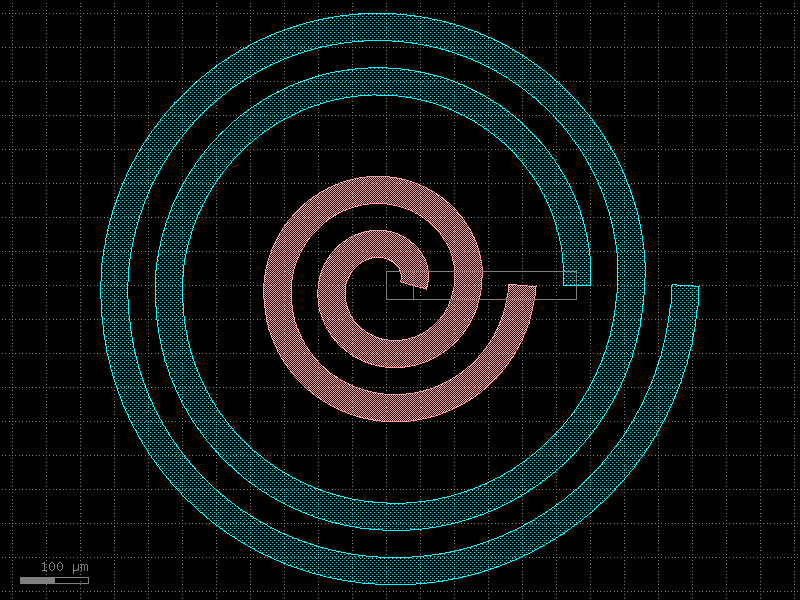
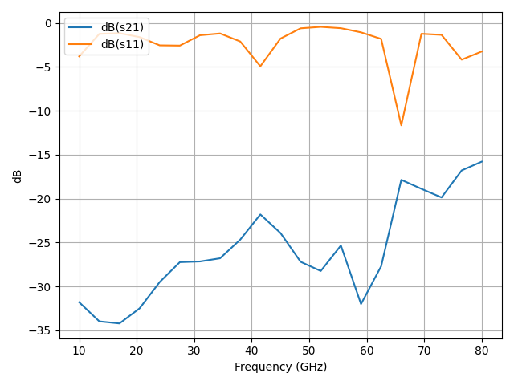

# Parametric RF Transformer P-Cell & OpenEMS Simulation

This project provides a complete workflow for generating and simulating planar RF spiral transformers. It uses `gdsfactory` for parametric GDS layout generation and `OpenEMS` for full-wave electromagnetic simulation.




## Key Features

-   **Parametric GDS Generation**: A flexible `gdsfactory` p-cell (`transformer_pcell.py`) creates spiral transformers based on geometric parameters.
-   **Automated Simulation Pipeline**: A master script (`simulate_transformer.py`) handles the entire simulation process from GDS to S-parameters.
-   **Configuration Driven**: Simulations are controlled by simple JSON files, making it easy to run parametric sweeps.
-   **Data Extraction & Visualization**: Automatically extracts S-parameters to CSV and generates publication-ready plots.

## Project Structure

```
.
├── configs/
│   └── example.json           # Simulation configuration files
├── outputs/
│   └── ...                    # Generated GDS, CSV, and plot files
├── simulate_transformer.py    # Main simulation script
├── transformer_pcell.py       # gdsfactory parametric cell for the transformer
└── README.md
```

## Installation

1.  **Prerequisites**:
    *   Python 3.9+
    *   [OpenEMS](http://openems.de/start/index.php) & CSXCAD must be installed and accessible from your system's `PATH`.

2.  **Install Python Dependencies**:
    Clone the repository and install the required packages.
    ```bash
    pip install numpy matplotlib gdsfactory
    ```

## How to Use

### 1. Create a Configuration File

Define the transformer geometry and simulation settings in a JSON file inside the `configs/` directory. For example:

```json
{
  "f1_ghz": 10,
  "f2_ghz": 80,
  "N1": 2,
  "N2": 2,
  "w_um": 40.0,
  "s_um": 40.0,
  "r1_primary_inner_um": 40.0,
  "eps_r_substrate": 4.4,
  "h_substrate_um": 100.0,
  "metal_thickness_um": 2.0,
  "substrate_tand": 0.02,
  "sim_box_padding_factor": 2,
  "mesh_resolution_factor": 3,
  "EndCriteria": 1e-4,
  "NrTS": 80000,
  "numThreads": 20,
  "fsteps_output": 21,
  "add_common_ground_via": true,
  "common_via_radius_um": 10.0
}
```

### 2. Run the Simulation

You can run a single simulation or all configurations in the `configs` directory.

-   **To run a specific configuration**:
    ```bash
    python simulate_transformer.py configs/my_xf.json
    ```

-   **To run all configurations in the `configs/` directory**:
    ```bash
    python simulate_transformer.py
    ```

### 3. Check the Results

The script will create a dedicated folder in `outputs/` for each configuration (e.g., `outputs/my_xf/`). This folder will contain:
-   A `.gds` file of the simulated layout.
-   A `.csv` file with the S-parameter data (magnitude and phase).
-   `.png` and `.pdf` plots of the S-parameter results.

## Technical Overview

### P-Cell (`transformer_pcell.py`)

-   **Primary Coil**: GDS layer `(1, 0)`
-   **Secondary Coil**: GDS layer `(2, 0)`
-   **Common Inner Arms**: GDS layer `(100, 0)` to avoid geometric conflicts at the center.
-   **Ports**: `o1` (primary output), `o2` (secondary output), and `common` (center ground connection).

### Simulation (`simulate_transformer.py`)

-   **Stackup**: The transformer's copper layers are placed on a single dielectric substrate backed by a perfect ground plane.
-   **Boundaries**: The simulation volume is enclosed by Perfect Electric Conductor (PEC) walls.
-   **Ports**: Lumped element ports are defined at the `o1` and `o2` terminals. The `common` port is grounded via a simple cylindrical via.
-   **Meshing**: The mesh resolution is automatically determined by the smallest geometric feature (`w_um`, `s_um`) and the `mesh_resolution_factor`.

## Assumptions & Limitations

-   **Single Metal Layer**: All spirals and connection arms are assumed to be on the same physical metal layer. Interleaved or multi-layer transformer designs are not supported.
-   **Substrate Model**: The model uses a single, uniform dielectric substrate on an infinite ground plane.
-   **Via Model**: The grounding via is a simple cylinder. For high-frequency analysis, a more detailed via model may be necessary.
-   **Computational Cost**: Simulation time and memory usage increase significantly with finer meshes, higher frequencies, and stricter convergence criteria (`EndCriteria`).

## Potential Enhancements

-   Support for multi-layer or interleaved spiral geometries.
-   Implementation of more sophisticated via and port models.
-   Integration with optimization libraries (e.g., Bayesian optimization) for automated design exploration.
